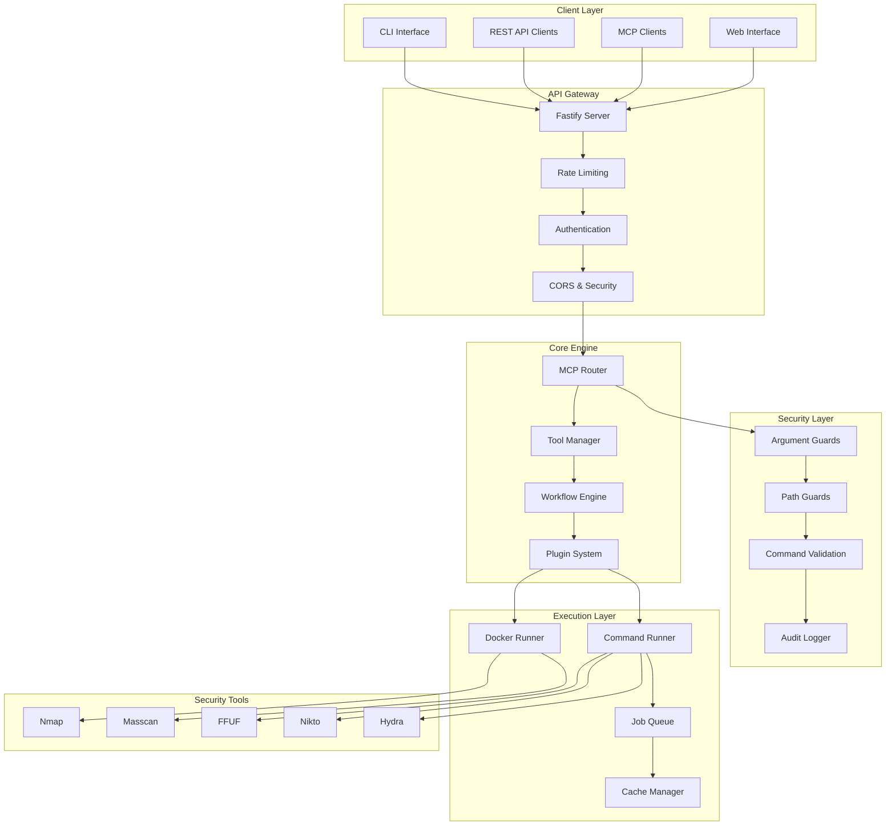
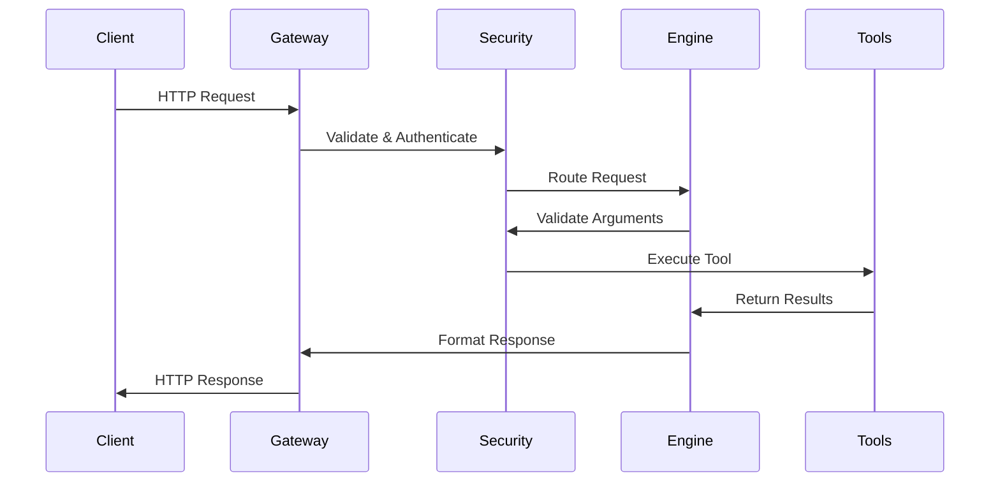

# Architecture Overview

RedQuanta MCP is built with a **multi-layered security-first architecture** designed for enterprise-grade penetration testing orchestration.

## 🏗️ System Architecture



## 🔧 Core Components

### API Gateway Layer

**Purpose**: HTTP/JSON interface for external integration

=== "Fastify Server"
    
    - **High-performance HTTP server** with async/await support
    - **Plugin architecture** for modular functionality
    - **Built-in schema validation** with JSON Schema
    - **Automatic OpenAPI generation** from route definitions
    - **Request/response hooks** for cross-cutting concerns

=== "Security Middleware"
    
    - **Rate Limiting**: 60 requests/minute, 10 scans/hour
    - **CORS Protection**: Configurable cross-origin policies
    - **Helmet Security**: Standard HTTP security headers
    - **Request Validation**: Comprehensive input sanitization
    - **Authentication**: API key and token-based auth

### Core Engine

**Purpose**: Business logic and orchestration

=== "MCP Router"
    
    ```typescript
    // Core routing and protocol handling
    class MCPRouter {
      private tools: Map<string, Tool>;
      private resources: Map<string, Resource>;
      
      async handleRequest(request: MCPRequest): Promise<MCPResponse> {
        // Route to appropriate handler
        // Apply security policies
        // Execute tool/resource operation
        // Return structured response
      }
    }
    ```

=== "Tool Manager"
    
    ```typescript
    // Tool lifecycle management
    class ToolManager {
      async executeTool(name: string, args: object): Promise<ToolResult> {
        // Validate arguments
        // Apply security guards
        // Execute tool safely
        // Process results
        // Cache if appropriate
      }
    }
    ```

=== "Workflow Engine"
    
    ```typescript
    // Multi-step security assessments
    class WorkflowEngine {
      async executeWorkflow(config: WorkflowConfig): Promise<WorkflowResult> {
        // Plan execution steps
        // Execute tools in sequence/parallel
        // Correlate results
        // Generate comprehensive report
      }
    }
    ```

### Security Layer

**Purpose**: Multi-layer defense and validation

=== "Argument Guards"
    
    ```typescript
    // Prevent command injection
    function validateArgs(args: string[]): void {
      for (const arg of args) {
        if (INJECTION_PATTERNS.some(pattern => pattern.test(arg))) {
          throw new SecurityError('Potential command injection detected');
        }
      }
    }
    ```

=== "Path Guards"
    
    ```typescript
    // Enforce filesystem boundaries
    function validatePath(path: string): void {
      const canonicalPath = resolve(path);
      if (!canonicalPath.startsWith(JAIL_ROOT)) {
        throw new SecurityError('Path outside jail boundary');
      }
    }
    ```

## 🛡️ Security Architecture

### Defense in Depth

RedQuanta MCP implements **5 layers of security**:

1. **Network Layer**: TLS encryption, network segmentation
2. **Application Layer**: Input validation, output encoding
3. **Logic Layer**: Business rule enforcement, access controls
4. **Data Layer**: Encryption at rest, secure storage
5. **Infrastructure Layer**: Container isolation, resource limits

### Zero Trust Model

- **Explicit Verification**: Every request is authenticated and authorized
- **Least Privilege Access**: Minimal required permissions only
- **Assume Breach**: Comprehensive logging and monitoring

### Threat Model

| Threat | Mitigation | Implementation |
|--------|------------|----------------|
| **Command Injection** | Input validation, allow-listing | ArgGuard patterns |
| **Path Traversal** | Canonical path checking | PathGuard boundaries |
| **Privilege Escalation** | Least privilege, sandboxing | Docker containers |
| **Data Exfiltration** | Output filtering, auditing | Audit logger |
| **DoS Attacks** | Rate limiting, resource limits | Fastify plugins |

## 📊 Data Flow Architecture

### Request Processing Pipeline



### Data Storage

=== "Temporary Data"
    
    - **Location**: `/tmp` within jail boundary
    - **Lifecycle**: Cleaned after job completion
    - **Purpose**: Tool input/output files
    - **Security**: Restricted permissions, size limits

=== "Persistent Data"
    
    - **Configuration**: Read-only files in `/config`
    - **Logs**: Append-only audit trail in `/logs`
    - **Reports**: Generated output in `/reports`
    - **Cache**: Redis-compatible in-memory storage

=== "Sensitive Data"
    
    - **API Keys**: Environment variables only
    - **Credentials**: Never stored, ephemeral only
    - **Results**: Sanitized before storage
    - **Logs**: PII-free audit information

## 🔄 Plugin Architecture

### Plugin Interface

```typescript
interface SecurityTool {
  name: string;
  description: string;
  schema: JSONSchema;
  
  validate(args: object): ValidationResult;
  execute(args: object): Promise<ToolResult>;
  cleanup?(jobId: string): Promise<void>;
}
```

### Plugin Lifecycle

1. **Discovery**: Scan plugin directory for compatible modules
2. **Validation**: Verify plugin interface and security
3. **Registration**: Add to tool registry with metadata
4. **Execution**: Call plugin with validated arguments
5. **Cleanup**: Resource cleanup and temporary file removal

### Built-in Plugins

| Plugin | Purpose | Integration |
|--------|---------|-------------|
| **nmap.ts** | Network scanning | Native TypeScript |
| **masscan.ts** | High-speed scanning | Command wrapper |
| **ffuf.ts** | Web fuzzing | Command wrapper |
| **nikto.ts** | Web vulnerability scanning | Command wrapper |
| **hydra.ts** | Brute force testing | Command wrapper |

## 🚀 Performance Architecture

### Asynchronous Design

- **Non-blocking I/O**: All operations use async/await
- **Event-driven**: Reactive programming patterns
- **Stream Processing**: Large dataset handling
- **Worker Threads**: CPU-intensive task offloading

### Caching Strategy

=== "Multi-level Caching"
    
    ```typescript
    class CacheManager {
      private l1Cache: Map<string, any>; // In-memory
      private l2Cache: RedisClient;      // Redis
      private l3Cache: FileSystem;       // Disk
      
      async get(key: string): Promise<any> {
        return await this.l1Cache.get(key) ||
               await this.l2Cache.get(key) ||
               await this.l3Cache.get(key);
      }
    }
    ```

=== "Cache Policies"
    
    - **TTL-based**: Time-based expiration
    - **LRU Eviction**: Least recently used removal
    - **Size Limits**: Memory usage constraints
    - **Invalidation**: Smart cache clearing

### Resource Management

- **Connection Pooling**: Database and external service connections
- **Memory Limits**: Per-tool and global memory constraints
- **CPU Throttling**: Prevent resource exhaustion
- **Disk Quotas**: Storage usage monitoring

## 🔧 Deployment Architecture

### Container Strategy

=== "Multi-stage Builds"
    
    ```dockerfile
    # Build stage
    FROM node:20-alpine AS builder
    COPY package*.json ./
    RUN npm ci --only=production
    
    # Runtime stage
    FROM node:20-alpine AS runtime
    RUN addgroup -g 1001 -S redquanta
    RUN adduser -S redquanta -u 1001
    USER redquanta
    COPY --from=builder /app .
    ```

=== "Security Hardening"
    
    - **Non-root user**: All processes run as restricted user
    - **Read-only filesystem**: Immutable container images
    - **Resource limits**: CPU, memory, and disk quotas
    - **Network isolation**: Minimal network access

### Orchestration

=== "Kubernetes"
    
    ```yaml
    apiVersion: apps/v1
    kind: Deployment
    metadata:
      name: redquanta-mcp
    spec:
      replicas: 3
      selector:
        matchLabels:
          app: redquanta-mcp
      template:
        spec:
          containers:
          - name: redquanta-mcp
            image: redquanta/mcp:0.3.0
            resources:
              limits:
                cpu: 1000m
                memory: 1Gi
              requests:
                cpu: 500m
                memory: 512Mi
    ```

=== "Docker Compose"
    
    ```yaml
    version: '3.8'
    services:
      redquanta-mcp:
        image: redquanta/mcp:latest
        ports:
          - "5891:5891"
        environment:
          - NODE_ENV=production
          - LOG_LEVEL=info
        volumes:
          - ./config:/app/config:ro
          - ./logs:/app/logs
        restart: unless-stopped
    ```

## 📈 Scalability Considerations

### Horizontal Scaling

- **Stateless Design**: No server-side session state
- **Load Balancing**: Multiple instance support
- **Database Sharding**: Distributed data storage
- **CDN Integration**: Static asset delivery

### Vertical Scaling

- **Memory Optimization**: Efficient data structures
- **CPU Optimization**: Algorithmic improvements
- **I/O Optimization**: Async processing patterns
- **Network Optimization**: Connection reuse

---

!!! tip "Architecture Deep Dive"
    
    **Want to understand more?**
    
    - [**Plugin Development**](plugin-development.md) - Create custom tools
    - [**Security Model**](../security/model.md) - Security implementation details
    - [**Performance Tuning**](performance.md) - Optimization techniques
    - [**Deployment Guide**](../deployment/docker.md) - Production deployment 