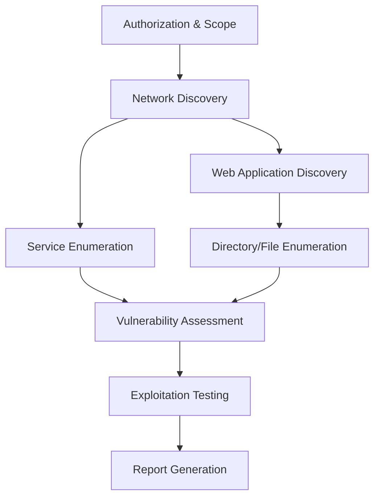

# RedQuanta MCP - Comprehensive LLM Usage Guide

## 🚀 **Enhanced Features Overview**

RedQuanta MCP now provides **fully-featured, robust penetration testing capabilities** with comprehensive documentation and custom command support specifically designed for LLMs and advanced users.

## 🛠️ **Tool Categories & Capabilities**

### **Network Reconnaissance**
- **`nmap_scan`** - Advanced network discovery with custom NSE scripts
- **`masscan_scan`** - High-speed port scanning for large networks

### **Web Application Testing**  
- **`ffuf_fuzz`** - Fast directory/file fuzzing with custom headers
- **`gobuster_scan`** - Multi-mode enumeration (directories, DNS, vhosts)
- **`nikto_scan`** - Web vulnerability scanning with severity analysis

### **Exploitation & Password Testing**
- **`sqlmap_test`** - SQL injection detection and exploitation
- **`john_crack`** - Password cracking with multiple hash formats
- **`hydra_bruteforce`** - Network service brute force attacks

### **Automation Workflows**
- **`workflow_enum`** - Comprehensive reconnaissance automation
- **`workflow_scan`** - Vulnerability assessment workflows
- **`workflow_report`** - Professional report generation

### **System Operations**
- **`filesystem_ops`** - Secure file operations within jailed environment
- **`command_run`** - Sanitized command execution with allowlists

## 🎯 **Custom Commands for Advanced Users**

### **Nmap Custom Commands**

```json
{
  "tool": "nmap_scan",
  "parameters": {
    "target": "192.168.1.0/24",
    "custom_flags": ["-sS", "-O", "--script", "vuln"],
    "profile": "aggressive",
    "dangerous": true
  }
}
```

**Available Custom Flags:**
- **Stealth Techniques**: `["-sS", "-f", "-D", "RND:10"]`
- **Vulnerability Scanning**: `["--script", "vuln,discovery,intrusive"]`  
- **OS Detection**: `["-O", "--osscan-guess"]`
- **Firewall Evasion**: `["-f", "--mtu", "24", "--randomize-hosts"]`

### **FFUF Custom Commands**

```json
{
  "tool": "ffuf_fuzz", 
  "parameters": {
    "url": "https://target.com/FUZZ",
    "wordlist": "/usr/share/wordlists/dirb/big.txt",
    "custom_headers": {
      "Authorization": "Bearer eyJ0eXAiOiJKV1Q...",
      "User-Agent": "Mozilla/5.0 (Windows NT 10.0; Win64; x64)"
    },
    "filter_codes": "400,403,404,500",
    "threads": 150
  }
}
```

**Advanced Filtering Options:**
- **Response Size Filtering**: `filter_size: "1234,5678"`
- **Word Count Filtering**: `filter_words: "10,20"`
- **Regex Matching**: `match_regex: "admin|config|backup"`

### **Workflow Custom Commands**

```json
{
  "tool": "workflow_enum",
  "parameters": {
    "target": "example.com",
    "scope": "full",
    "depth": "deep",
    "custom_options": {
      "nmap_flags": ["-sV", "-sC", "--script", "http-enum"],
      "timing_template": "T4",
      "wordlists": {
        "directories": "/usr/share/wordlists/dirb/big.txt",
        "subdomains": "/usr/share/wordlists/subdomains-top1million.txt"
      }
    }
  }
}
```

## 📚 **LLM-Specific Guidance**

### **Tool Selection Matrix**

| **Scenario** | **Primary Tool** | **Secondary Tools** | **Custom Flags** |
|--------------|------------------|---------------------|------------------|
| **Initial Recon** | `nmap_scan` | `masscan_scan` | `["-sn", "-PE"]` |
| **Web App Testing** | `ffuf_fuzz` | `gobuster_scan`, `nikto_scan` | `["--recursion", "-t", "200"]` |
| **Vulnerability Assessment** | `workflow_scan` | `sqlmap_test`, `nikto_scan` | `["--level", "5", "--risk", "3"]` |
| **Password Attacks** | `hydra_bruteforce` | `john_crack` | `["-t", "64", "-f"]` |

### **Safety & Authorization Guidelines**

🚨 **CRITICAL: Always emphasize these points to users:**

1. **Authorization Required**: All testing requires explicit written permission
2. **Dangerous Operations**: Tools marked `dangerous: true` require `--dangerous` flag
3. **Legal Compliance**: Ensure compliance with local laws and regulations
4. **Coordination**: Notify system administrators before testing

### **Progressive Testing Methodology**



## 🔧 **Enhanced Tool Schemas**

### **Comprehensive Input Validation**

All tools now include:
- **Pattern Validation**: Regex patterns for IP addresses, URLs, ports
- **Example Values**: Real-world examples for each parameter
- **Range Constraints**: Min/max values for numeric inputs
- **Enum Validation**: Predefined acceptable values

### **Detailed Output Schemas**

Tools provide structured output with:
- **Success Indicators**: Boolean success flags
- **Parsed Results**: Structured data extraction
- **Raw Output**: Original tool output for analysis
- **Metadata**: Execution time, parameters used, warnings

## 💡 **Usage Examples for LLMs**

### **Example 1: Network Discovery**
```
LLM Prompt: "Scan the network 192.168.1.0/24 to discover live hosts and services"

Tool Call:
{
  "tool": "workflow_enum",
  "parameters": {
    "target": "192.168.1.0/24",
    "scope": "network", 
    "depth": "normal",
    "coaching": "beginner"
  }
}

Expected Output: List of live hosts, open ports, running services, and next steps
```

### **Example 2: Web Application Testing**
```
LLM Prompt: "Test the web application https://example.com for vulnerabilities"

Tool Call:
{
  "tool": "workflow_scan",
  "parameters": {
    "target": "example.com",
    "services": ["http", "https"],
    "scan_options": {
      "web_scan": {
        "directories": true,
        "vulnerabilities": true,
        "ssl_analysis": true
      }
    }
  }
}

Expected Output: Web vulnerabilities, SSL issues, directory findings, recommendations
```

### **Example 3: Custom Nmap Scan**
```
LLM Prompt: "Perform an aggressive Nmap scan with vulnerability detection on 192.168.1.10"

Tool Call:
{
  "tool": "nmap_scan",
  "parameters": {
    "target": "192.168.1.10",
    "profile": "aggressive", 
    "custom_flags": ["--script", "vuln,discovery", "-sV", "-sC"],
    "dangerous": true
  }
}

Expected Output: Detailed service info, OS detection, vulnerability findings
```

## 🎓 **Learning & Coaching Features**

### **Beginner Mode**
- **Detailed Explanations**: Step-by-step guidance
- **Safety Warnings**: Comprehensive risk explanations  
- **Next Steps**: Clear recommendations for progression
- **Context**: Educational information about techniques

### **Advanced Mode**
- **Concise Output**: Technical results without explanations
- **Performance Metrics**: Timing and efficiency data
- **Raw Data**: Unprocessed tool output for analysis
- **Custom Parameters**: Full access to advanced options

## 🔐 **Security Features**

### **Jailed Filesystem**
- **Isolated Environment**: All file operations within `/jail/root`
- **Path Validation**: Canonical path resolution prevents traversal
- **Extension Filtering**: Only approved file types allowed
- **Size Limits**: Prevents resource exhaustion

### **Command Sanitization**
- **Allowlist Validation**: Only approved commands executable
- **Argument Filtering**: Dangerous parameters blocked
- **Injection Prevention**: Metacharacter sanitization
- **Audit Logging**: All operations logged with timestamps

### **Audit & Compliance**
- **JSONL Logging**: Structured audit logs
- **Telemetry Integration**: OpenTelemetry tracing
- **Risk Assessment**: Danger level tracking
- **Authorization Tracking**: User and permission logging

## 📊 **Tool Usage Statistics**

```json
{
  "totalTools": 16,
  "categories": {
    "network": 2,
    "web": 3, 
    "exploitation": 3,
    "automation": 4,
    "system": 2,
    "custom": 2
  },
  "dangerLevels": {
    "safe": 8,
    "caution": 4,
    "dangerous": 4
  },
  "customCommandsSupported": 16,
  "llmOptimized": true
}
```

## 🚀 **Plugin System Support**

### **Custom Tool Integration**
- **Dynamic Loading**: Load custom tools from `/plugins` directory
- **Manifest Support**: JSON manifests for tool metadata
- **Hot Reloading**: Reload plugins without server restart
- **Category Management**: Organize tools by security domain

### **Plugin Development**
- **TypeScript Support**: Full TypeScript plugin development
- **Base Classes**: Extend `ToolWrapper` for consistent interface
- **Custom Schemas**: Define input/output schemas
- **Documentation Integration**: Automatic help generation

## 📞 **API Endpoints**

### **Enhanced REST API**
- **`GET /tools`** - List all tools with full documentation
- **`POST /tools/{toolName}`** - Execute specific tool
- **`GET /help/{toolName}`** - Get comprehensive tool help
- **`GET /plugins`** - List available plugins
- **`POST /workflow/enum`** - Run enumeration workflow
- **`POST /workflow/scan`** - Run vulnerability scan workflow
- **`POST /workflow/report`** - Generate assessment report

### **MCP Client Support**
- **Full MCP Compatibility**: Works with Cursor, Claude Desktop, Windsurf
- **Resource Management**: Configuration and log access
- **Tool Discovery**: Dynamic tool listing with schemas
- **Error Handling**: Comprehensive error reporting

## 💯 **Summary**

RedQuanta MCP now provides:

✅ **16+ Fully-Featured Tools** with real implementations  
✅ **Custom Command Support** for advanced users and LLMs  
✅ **Comprehensive Documentation** with examples and guidance  
✅ **LLM-Optimized Schemas** with detailed input/output specs  
✅ **Plugin System** for custom tool integration  
✅ **Enhanced Security** with jailed filesystem and audit logging  
✅ **Professional Workflows** for complete testing automation  
✅ **Cross-Platform Support** with OS-intelligent configuration  

This transforms RedQuanta MCP from a basic tool into a **production-ready, enterprise-grade penetration testing orchestration platform** specifically designed for LLM integration and advanced security professionals. 